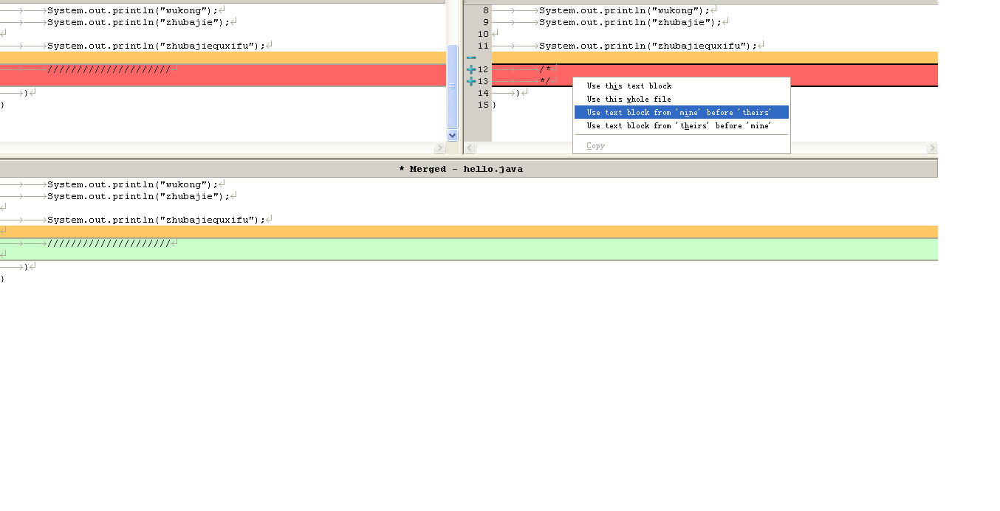
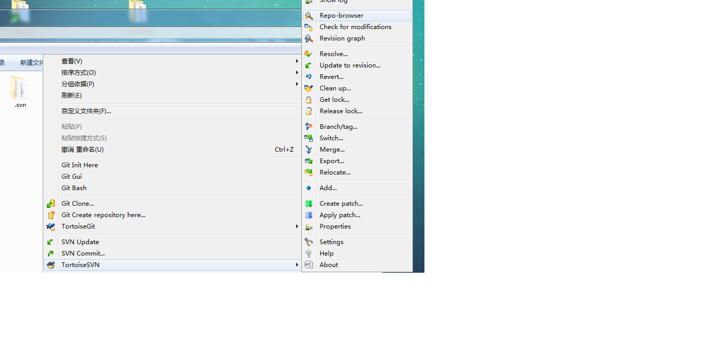

#####版本控制

######常用的版本控制工具
1. cvs  老的版本控制
2. svn  替代的cvs
3. clearcase cc  大型专业版本控制（收费）
4. vss  ms的版本控制  集成visualstdio工具
5. git  分布式的版本控制

#####svn的用法
1. 创建服务器
2. 创建客户端 并且连接
	1. https://服务器的ip/svn/serverone/
    2. 创建文件夹 右键--》svn checkout--》输入上面的路径
    3. 输入密码 管理服务器 图标变成绿色的对号
    4. 开发
	    1. 创建源文件 默认的图标是？
	    2. 管理文件 右键文件 选择 add  文件的图标变成+
	    3. 右键 选择svn commit --》 写上注释-->点击ok ，文件的图标变成绿的对话
	    4. 修改文件，文件的图标变成了红色感叹号,右键提交代码，提交成功后图标变成绿色的对号
	    5. 另一个用户就右键点击 svnupdate 来更新服务器的代码

3. 版本库的备份和还原

4. 清除本地账户信息
	1. 请看下图

5. 解决版本冲突
	1. update
		1. 文件的图标变成三角黄色感叹号
	2. 点击文件，右键，如下图：

	3. 编辑冲突

6. eclipse里解决冲突
	1. 添加忽略的文件

	2. 右键工程 与资源同步

    3. 覆盖

7. 灰色的锁
	1. 创建只读锁

提交到服务器,图标就变成灰色的对号
	2. 只读锁
		1. bug 只有修改文件的属性类型 就可以直接编辑提交
    3. 取消只读锁
	    1.  选择remove update代码
	4. 哪个用户都可以取消该锁
8. 强锁(黄色锁)
	1. 右键--> getlock
	2. 只有创建该锁用户才可以取消该锁
	3. 取消该锁--右键--》 releaselock
9. 红色X 删除了文件
	1. 通过svn删除，并没有提交到服务器，然后又创了同样的文件，该文件的图标是红色x
		

10. 沫沫的开发案例
	1. 创建仓库
	2. 下载仓库开发 
	3. 浏览仓库
	4. 创建里程碑
		
		
        
    5. 版本的合并
	    1. 
	    2. 

#####git的用户
1. 创建github上的账号
2. 创建一个仓库
3. 下载到本地
4. 开发
5. 提交
	
	